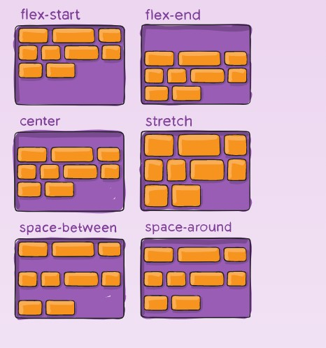

# Flex Layout

[Reference](https://css-tricks.com/snippets/css/a-guide-to-flexbox/)

## Background:

The Flex Layout aims at providing a more efficient way to lay out, align and distribute space among items in a container,
even when their size is unknown and/or dynamic. (thus the word "flex").

The main idea behind the flex layout is to give the container ability to alter items width/height and order to best fill the
available space.(mostly to accommodate to all kinds of display devices and screen sizes). A flex container expands items to fill available free space or
shrinks to prevent overflow.

Most importantly, the flexbox layout is direction-agnostic as opposed to regular layouts (block which is vertically-based and inline which is horizontally based).

*Note:* Flexbox layout is most appropriate to the components of an application, and small-scale layouts, while the Grid layout is intended for larger scale layouts.

## Basics and terminology

Since flexbox is a whole module and not a single property, it involves a lot of things including its whole set of properties. Some of them are meant to be set on the container (parent element, known as “flex container”) whereas the others are meant to be set on the children (said “flex items”).

If “regular” layout is based on both block and inline flow directions, the flex layout is based on “flex-flow directions”. 


Items will be laid out following either the `main axis` (from main-start to main-end) or the `cross axis` (from cross-start to cross-end).

* **main axis –** The main axis of a flex container is the primary axis along which flex items are laid out. Beware, it is not necessarily horizontal; it depends on the flex-direction property

* **main-start | main-end –** The flex items are placed within the container starting from main-start and going to main-end.

* **main size –** The flex item’s main size property is either the ‘width’ or ‘height’ property, whichever is in the main dimension.

* **cross axis –** The axis perpendicular to the main axis is called the cross axis. Its direction depends on the main axis direction.

* **cross-start | cross-end –** Flex lines are filled with items and placed into the container starting on the cross-start side of the flex container and going toward the cross-end side.

* **cross size –** The width or height of a flex item, whichever is in the cross dimension, is the item’s cross size. The cross size property is whichever of ‘width’ or ‘height’ that is in the cross dimension

## Flexbox properties:

### Properties for the Parent (flex container):


1. **display**

This defines a flex container; inline or block depending on the given value. It enables a flex context for all its direct children.

```css
    .container {
      display: flex; /* or inline-flex */
    }
```

2. **flex-direction**


This establishes the main-axis, thus defining the direction flex items are placed in the flex container. Flexbox is (aside from optional wrapping) a single-direction layout concept. Think of flex items as primarily laying out either in horizontal rows or vertical columns.

````css
    .container {
      flex-direction: row | row-reverse | column | column-reverse;
    }
````

* `row (default)`:  left to right in ltr; right to left in rtl
* `row-reverse`: right to left in ltr; left to right in rtl
* `column`: same as row but top to bottom
* `column-reverse`: same as row-reverse but bottom to top.

3. **flex-wrap**


By default, flex items will all try to fit onto one line. You can change that and allow the items to wrap as needed with this property.

```css
    .container {
      flex-wrap: nowrap | wrap | wrap-reverse;
    }
```

* `nowrap` (default): all flex items will be on one line
* `wrap`:  flex items will wrap onto multiple lines, from top to bottom.
* `wrap-reverse`: flex items will wrap onto multiple lines from bottom to top.

[Demos](https://css-tricks.com/almanac/properties/f/flex-wrap/)

4. **flex-flow**

This is a shorthand for the `flex-direction` and `flex-wrap` properties, which together define the flex container’s main and cross axes. The default value is `row nowrap`.

```css
    .container {
      flex-flow: column wrap;
    }
```

5. **justify-content**


This defines the alignment along the main axis. It helps distribute extra free space leftover when either all the flex items on a line are inflexible, or are flexible but have reached their maximum size. It also exerts some control over the alignment of items when they overflow the line.

```css
    .container {
      justify-content: flex-start | flex-end | center | space-between | space-around | space-evenly;
    }
```

* `flrx-start` (default): tems are packed toward the start of the flex-direction.
* `flex-end`: items are packed toward the end of the flex-direction.
* `center`:  items are centered along the line
* `space-between`: items are evenly distributed in the line; first item is on the start line, last item on the end line
* `space-around`: items are evenly distributed in the line with equal space around them. Note that visually the spaces aren’t equal, since all the items have equal space on both sides. The first item will have one unit of space against the container edge, but two units of space between the next item because that next item has its own spacing that applies.
* `space-evenly`: items are distributed so that the spacing between any two items (and the space to the edges) is equal.

*Note that that browser support for these values is nuanced. For example, space-between never got support from some versions of Edge, and start/end/left/right aren’t in Chrome yet.
The safest values are `flex-start`, `flex-end`, and `center`.

There are also two additional keywords you can pair with these values: `safe` and `unsafe`. Using `safe` ensures that however you do this type of positioning, you can’t push an element such that it renders off-screen (e.g. off the top) in such a way the content can’t be scrolled too (called “data loss”).

6. <a name="align-items"><a>**align-items**


This defines the default behavior for how flex items are laid out along the cross axis on the current line. Think of it as the `justify-content` version for the cross-axis (perpendicular to the main-axis).

```css
    .container {
      align-items: stretch | flex-start | flex-end | center | baseline;
    }
```

* `stretch` (default):  stretch to fill the container (still respect min-width/max-width)
* `flex-start` / `start` / `self-start`: items are placed at the start of the cross axis. The difference between these is subtle, and is about respecting the `flex-direction` rules or the `writing-mode` rules.
* `flex-end` / `end` / `self-end`: items are placed at the end of the cross axis. The difference again is subtle and is about respecting `flex-direction` rules vs. `writing-mode rules`.
* `center`: items are centered in the cross-axis
* `baseline`: items are aligned such as their baselines align.

7. **align-content**



This aligns a flex container’s lines within when there is extra space in the cross-axis, similar to how `justify-content` aligns individual items within the main-axis.

**Note:** This property only takes effect on multi-line flexible containers, where flex-flow is set to either `wrap` or `wrap-reverse`). A single-line flexible container (i.e. where flex-flow is set to its default value, `no-wrap`) will not reflect `align-content`.

```css
    .container {
      align-content: flex-start | flex-end | center | space-between | space-around | space-evenly | stretch | start | end | baseline | first baseline | last baseline + ... safe | unsafe;
    }
```

* `normal`(default)  items are packed in their default position as if no value was set.
* `flex-start`/`start`: items packed to the start of the container. The (more supported) `flex-start` honors the `flex-direction` while `start` honors the `writing-mode` direction.
* `flex-end`/ `end`: items packed to the end of the container. The (more support) `flex-end` honors the `flex-direction` while `end` honors the `writing-mode` direction.
* `center`: items centered in the container.
* `space-between`: items evenly distributed; the first line is at the start of the container while the last one is at the end.
* `space-around`: items evenly distributed with equal space around each line.
* `space-evenly`: items are evenly distributed with equal space around them.
* `stretch`: lines stretch to take up the remaining space.

### Properties for the Children (flex items):


1. **order**


By default, flex items are laid out in the source order. However, the order property controls the order in which they appear in the flex container.

```css
    .item {
      order: 5; /* default is 0 */
    }
```

2. **flex-grow**


This defines the ability for a flex item to grow if necessary. It accepts a unitless value that serves as a proportion. It dictates what amount of the available space inside the flex container the item should take up.

If all items have `flex-grow` set to 1, the remaining space in the container will be distributed equally to all children. If one of the children has a value of 2, the remaining space would take up twice as much space as the others (or it will try to, at least).

```css
    .item {
      flex-grow: 4; /* default 0 */
    }
```

**Note:** Negative numbers are invalid.
          
3. **flex-shrink**

The CSS `flex-shrink` property lets you specify how much a flex item will shrink if there is not enough space for it to fit in the flex container

```css
    .item {
      flex-shrink: 3; /* default 1 */
    }
```

This property is a direct opposite of `flex-grow`. They are often used together, and you can also use the CSS `flex` shorthand for both of them.

**Note:** Negative numbers are invalid.

4. **flex-basis**

This defines  initial length for flex items.

```css
    .item {
      flex-basis:  auto | content | 20px | 20%; /* default auto */
    }
```

* `auto`: The default value. The size of the element depends on `width` and `height` properties
* `content`: The size of the element depends on its content – this keyword isn’t well supported yet, so it’s hard to test and harder to know what its brethren `max-content`, `min-content`, and `fit-content` do.
* `Length units`: The initial size of the flex item defined in CSS length units (e.g., px)
* `Percentages`: The initial size of the flex item defined in percentages, representing the relation to the size of the parent flex container.

If set to 0, the extra space around content isn’t factored in. If set to `auto`, the extra space is distributed based on its `flex-grow` value.


5. flex

This is the shorthand for `flex-grow`, `flex-shrink` and `flex-basis` combined. The second and third parameters (`flex-shrink` 
and `flex-basis`) are optional. The default is `0 1 auto`, but if you set it with a single number value, it’s like `1 0`

```css
    .item {
      flex: none | [ <'flex-grow'> <'flex-shrink'>? || <'flex-basis'> ]
    }
```

**It is recommended that you use this shorthand property** rather than set the individual properties. The shorthand sets the other values intelligently.

6. **align-self**


This allows the default alignment (or the one specified by `align-items`) to be overridden for individual flex items.

Please see the [align-items](#align-items) explanation to understand the available values.

```css
    .item {
      align-self: auto | flex-start | flex-end | center | baseline | stretch;
    }
```

# Useful Links:
https://www.sketchingwithcss.com/samplechapter/cheatsheet.html

https://css-tricks.com/flex-grow-is-weird/

https://css-tricks.com/how-auto-margins-work-in-flexbox/


