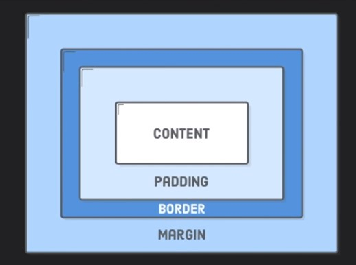
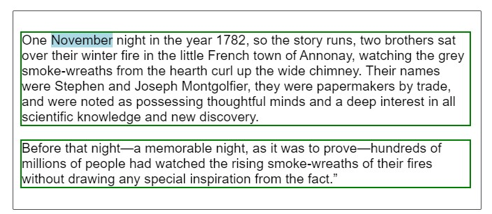
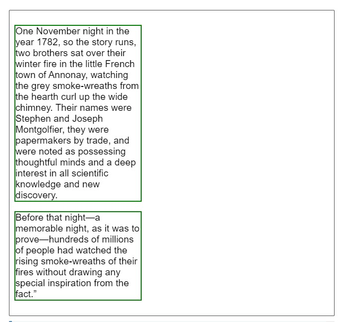
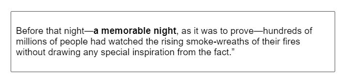
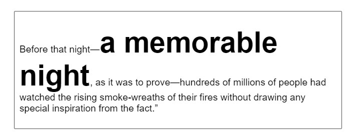

# CSS Selectors:

Selectors are ways of grabbing and manipulating HTML.
Types of selectors:

1. Element Selector:
Use the name of the tag to select it.

    a. You can select the entire elements on HTML page without any special characters.
    
    b. This applies to all the elements with that tag name on the page.
    
    c. It ranks on the bottom of the specificity scale.
    
Example:
```html
<h1>A Heading</h1>
<p>Some text.</p>
<h1>Another Heading</h1>
```
P-tag Element selector:

```css
p {
    color: red;
}
```

2. Class Selector:
Searches for the name of the class on the HTML page to select it.

    a. This is used to select elements with a certain class name.
    
    b. Can be used on any and all elements with that class.
    
    c. can be used multiple times, and is select with the `.` symbol.

Example:
```html
<h2 class="a-class">A Heading</h2>
<p class="a-class">Some text.</p>
```
P-tag Element selector:

```css
.a-class {
    color: blue;
}
```

3. ID Selector:
Similar to class selector but selects elements on the HTML page by id instead of class.
    
    a. This is used to select elements with a certain ID name.
    
    b. Can be used on any and all elements with that ID.
    
    c. Unlike classes, it can only be used on one element at a time, and is selected with the `#` symbol,, However, it is possible to use more than once.
    
Example:
```html
<p id="some-text">Some text</p>
<p id="some-text">Some More text.</p>
```
P-tag Element selector:

```css
#some-text {
    color: orange;
}
```    

# Classes and ID selectors:
Two most common selectors are class and ID selectors.
classes and IDs are different and can't be used interchangeably.
Classes are meant to be used multiple times. Ids are supposed to be unique and are to be used once.

# Specificity and when to use Selectors:
Specificity is talking about overriding the properties in css. 
Different selectors are more powerful/specific to the selectors.

Specificity sequence:
    
    ```
    # less powerful  ---- to----  more Powerful
    Element Selector --> Class Selector --> ID Selector --> inline- styling
    ```

# Pseudo-Selectors:
A CSS pseudo-selector/class is a keyword added to the main selector that specifies a special state of the selected element(s).
Pseudo Selectors can be used will Element, Class as well as ID selectors.
Some Pseudo-selectors:
   1. Hover - For example,`:hover` can be used to change a buttons color when the user's pointer hovers over it.

```css
    button:hover{
    color: blue;
}
```
   2. first-child: Selects first-child of the selected elements.
   *Note: The selector has to be a child not the parent for example:
   
   ```html
        <ul>
            <li>First element</li>
            <li>Second element</li>
            <li>Third element</li>
        </ul>
```
   
   if we try to select this by parent element `ul` this will not work.
   Instead we need to select the element we need to select.
   
   ```css
        ul:first-child {
        color: red;
            //This will not work!        
        }

        li:first-child {
            color: green;
            //This works!
        }       
```
 
   3. nth-child: Works similar to first-child and last-child here we need to specify the sequence number of the child.
    For example if we refer to the same `ul` tag example writing the below css selects second `li` tag:
```css
    li:nth-child(2){
       color: aqua; 
    }   
```    

   4. only-child: Selects if the selected element is the only-child element.
   
   ```html
    <ul>
        <li>Only child LI element</li>
    </ul>

    li:only-child{
        color: yellow;
    }
  ```

- Pseudo-selectors with the a tag:
     HTML tag used for the below example:
     ```html
      <a class="google-link" href="http://www.google.com"></a>
    ```  
    
    1. link - Selects and applies style if the `a` tag link is not visited.
    ```css
          .google-link:link{
        
           }       
    ```
    2. visited - Selects and applies style id the `a` tag is visited.
    
# CSS Combinators:
   1. Adjacent sibling combinator (`+`): separates two selectors and matches the second element only if it immediately follows the first element, and both are children of the same parent element.
        For example:
        ```html
              <div>
                <p>Some Text!</p>
                <textarea></textarea>
                <button>Submit1</button>
                <button>Submit2</button>
              </div>
        ```   
           
        ```css
                textarea + button {
                  color: blue;
                }
         ```
     
        The above snippet will select only the first button `<button>Submit1</button>` tag
        It will not select the second button as it is not directly adjacent to `<textarea>`
   
   2. General sibling combinator (`~`): The general sibling combinator (~) separates two selectors and matches the second element only if it follows the first element (though not necessarily immediately), and both are children of the same parent element.
        ```html
              <div>
                <textarea></textarea>
                <p>Some Text!</p>
                <button>Submit!</button>
              </div>    
        ```  
      Let's write a css selector that selects all buttons that follow a textarea
      ```css
          textarea ~ button { // Will select the above button
            color: blue;
          }
      
          textarea + button { // Will not select the above button
            color: blue;
          }
        ```
      
      ```html
             <div>
                  <p>Some Text!</p>
                  <textarea></textarea>
                  <button>Submit1</button>
                  <button>Submit2</button>
             </div>
      ```   
                 
      ```css
             textarea ~ button {
               color: blue;
             }
       ```
      
      For the above example both button tags will be selected.
            
   3. Descendant combinator (` `):  typically represented by a single space ( ) character — combines two selectors such that elements matched by the second selector are selected if they have an ancestor (parent, parent's parent, parent's parent's parent, etc) element matching the first selector.
         ```css
                 li {
                   list-style-type: disc;
                 }
                 
                 li li {
                   list-style-type: circle;
                 }
         ```
      
        ```html
              <ul>
                <li>   <!-- Disk -->
                  <div>Item 1</div>
                  <ul>
                    <li>Subitem A</li>  <!-- Circle -->
                    <li>Subitem B</li>  <!-- Circle -->
                  </ul>
                </li>
                <li>
                  <div>Item 2</div>
                  <ul>
                    <li>Subitem A</li>
                    <li>Subitem B</li>
                  </ul>
                </li>
              </ul>
        ```
      All `li` tags inside another `li` DOM tree hierarchy are converted to circle.   
         
   4. Child combinator (`>`): It matches only those elements matched by the second selector that are the direct children of elements matched by the first.

        ```css
              span {
                background-color: white;
              }
              
              div > span {
                background-color: DodgerBlue;
              }
        ```
      
      ```html
          <div>
            <span>Span #1, in the div.
              <span>Span #2, in the span that's in the div.</span>
            </span>
          </div>
          <span>Span #3, not in the div at all.</span>
      ```
      Only Span #1 is colored DodgerBlue.
     
# Attribute selectors: 
The CSS attribute selector matches elements based on the presence or value of a given attribute.     

  ```css
        /* <a> elements with a title attribute */
        a[title] {
          color: purple;
        }
        
        /* <a> elements with an href matching "https://example.org" */
        a[href="https://example.org"] {
          color: green;
        }
        
        /* <a> elements with an href containing "example" */
        a[href*="example"] {
          font-size: 2em;
        }
        
        /* <a> elements with an href starting with "https" */
        a[href^="https"] {
          font-size: 2em;
        }
        
        /* <a> elements with an href ending ".org" */
        a[href$=".org"] {
          font-style: italic;
        }
        
        /* <a> elements whose class attribute contains the word "logo" */
        a[class~="logo"] {
          padding: 2px;
        }
   ```
# Colors 
1. CSS color names (Named colors) - red, blue etc.
2. Hex color codes - Starts with # tag and takes 6 Hex-numbers. First 2 digits represents number of red in the color and subsequent pair of 2 represent green and blue respectively.
3. rgb code - represented as rgb(12,12,233); individual params can range from 0-255. 

#Important Background property:

Background images using Web or local URLs

```css
    body { // using web URLs
        background: url("http://some-pic-url");
        // or
        background-image: url("http://some-pic-url");
    }
    
    body { // using local URLs
            background: url("img/img-1.jpg");
    }
   
```

By Default HTML tries to fill the entire background by repeating the image. To for it not to repeat use the background-repeat property.

```css
    body {
            background: url("img/img-1.jpg");
            background-repeat: no-repeat; // Default value is repeat
    }   
```
Property background-repeat also support repeat-x and repeat-y properties.

But this does not stretch the image to cover the entire background. Use background-size property to fix this.

```css
    body {
            background: url("img/img-1.jpg");
            background-size: 400px 70%; // static values
            background-size: contain; // stretch without breaking propotion 
            background-size: cover; // takes full value by stretching fully
    }   
```

#Opacity/Transparency:
1. rgba function: the fourth parameter is called the alpha parameter. It can take values from 0 to 1.
the lower values make color more transparent or light while increasing the value will make it more darker.

    ```css
           body {
               background-color: rgb(204,229,255);
               background-color: rgba(204,229,255, 0.2); // more lighter version of the color
               background-color: rgba(204,229,255, 0.8); // slight lighter version of the color
           }   
    ```

# Gradients: 
Gradients is a transition between two or more colors.
There are two types linear(left to right, top to bottom or diagonally) and radial(circular , move outwards from center)
   ```css
        div {
            background: linear-gradient(to right, red, green, blue);
            background: linear-gradient(to top, red, green, blue);
            background: linear-gradient(to bottom left, red, green, blue);
        }   
   ``` 
 We can also use angles to define direction.
 
 ```css
       div {
            background: linear-gradient(220deg, red, green);
       } 
```
 
Example of redial-gradient - By default from centre to outwards. Default shape is ellipse

   ```css
        body {
            background: radial-gradient(circle, red 20%, blue 40%, green 55%);
        }
   ```
 The percentages have to be in ascending order form left to right.
 
 #Types of units: (Refer [https://kyleschaeffer.com/css-font-size-em-vs-px-vs-pt-vs-percent](https://kyleschaeffer.com/css-font-size-em-vs-px-vs-pt-vs-percent))
 Two types of units in CSS 
  1. Absolute Units - cm, mm and inch - they are not affected by anything around them, they remain absolute. 
    Pixel (`px`): Considered as an absolute unit, it is actually relativelly scaled depending on the device you are on. Low DPI devices have larger representation of one pixel that High pixel devices.
    cm, inch and mm: Absolute Unit - represents size in cm/inch or mm.
    Point (`pt`): Little bit bigger that pixels 
    pc: Lot bigger than pixel (1 pc = 12 pt)
    
  2. Relative Units - % Depended on Something 
    Percent Unit (`%`): This unit depends on the parent container size, any number representation before the % symbol means the size is that many percent relative to the parent container of the selected tag.
    em: Size relative to current standard font-size.
    View Width (`vw`) and View Height (`vh`): Allow you work with the view port. 1 vw or vh = 1% of body width or body height. It is not based on parent element but the entire screen view-port.

#CSS Box Model:
- The CSS Box model is a series of positioning properties designed to help with layout.
- Each property works in a different way, and positions the item with different spacing.
- The Box model is the most commonly used way to position items.


 
Padding: represent the space between the content and the border. Give more room around the content.
Border : is the divider between the padding and the margin. It can be styled using a CSS property called `border`.
Margin : is the space between border and all other surrounding items/content.

Padding is used for internal space, while margin is used for external space.

#Changing Content Size:
//TODO:

#CSS Flow Layout

Normal Flow, of Flow Layout, is the way that Block and inline elements are displayed on a page before any changes are made to their layout.
The flow is essentially a set of things that are all working together and know about each other in your layout. Once something is taken out of flow it works independently.

In normal flow *Inline* elements display in the inline direction, that is in the direction words are displayed in a sentence according to the writing Mode of the  document. If there is not enough space in the containing block for all of the boxes a box can break onto a new line.
*Block* elements display one after other, as paragraphs do in the Writing Mode of the document. In English therefore, inline elements display one after the other, starting from left to right,
and block elements start at the top and move down the page.

Example - 
The following example demonstrates Block and inline Level boxes. The two paragraph elements wit a green border are Block level, displaying one under the other.

Tge first sentence also includes a span element with a blue background, This is inline level therefore displays in place in the sentence.



```css
    p {
        border: 2px solid green;
    }
    span {
        background-color: lightblue;
    }
```
  
```html
<div class="box">
    <p>One <span>November</span> night in the year 1782, so the story runs, two brothers sat over their winter fire in the little French town of Annonay, watching the grey smoke-wreaths from the hearth curl up the wide chimney. Their names were Stephen and Joseph Montgolfier, they were papermakers by trade, and were noted as possessing thoughtful minds and a deep interest in all scientific knowledge and new discovery.</p>
    <p>Before that night—a memorable night, as it was to prove—hundreds of millions of people had watched the rising smoke-wreaths of their fires without drawing any special inspiration from the fact.”</p>
</div>
```  

By default block elements will consume all of the space in the inline direction, so our paragraphs spread out and get as big as they can inside their containing block. If we give them a width, they will continue to lay out one below the other - even if there would be space for them to be side by side. Each will start against the start edge of the containing block, so the place at which sentences would begin in that writing mode.



```css
    p {
        border: 2px solid green;
        width: 40%;
    }
```

#Margin collapse
The spec explains that margins between block elements collapse. This means that if you have an element with a top margin immediately after an element with a bottom margin, rather than the total space being the sum of these two margins, the margin collapses, and so will essentially become as large as the larger of the two margins.

[Further Reading](https://developer.mozilla.org/en-US/docs/Web/CSS/CSS_Box_Model/Mastering_margin_collapsing)

#Elements participating in an inline formatting context

Inline elements display one after the other in the direction that sentences run in that particular writing mode. While we don’t tend to think of inline elements as having a box, as with everything in CSS they do. These inline boxes are arranged one after the other. If there is not enough space in the containing block for all of the boxes a box can break onto a new line. The lines created are known as line boxes.

In the following example, we have three inline boxes created by a paragraph with a `<strong>` element inside it.



```html
    <p>Before that night—<strong>a memorable night</strong>, as it was to prove—hundreds of millions of people had 
    watched the rising smoke-wreaths of their fires without drawing any special inspiration from the fact.”</p>
```

The boxes around the words before the `<strong>` element and after the `<strong>` element are referred to as anonymous boxes, 
boxes introduced to ensure that everything is wrapped in a box, but ones that we cannot target directly.

The line box size in the block direction (so the height when working in English) is defined by the tallest box inside it. In the next example, 
I have made the `<strong>` element 300%; that content now defines the height of the line box on that line.



```css
    strong {
        font-size: 300%;
    }
```

```html
    <p>Before that night—<strong>a memorable night</strong>, as it was to 
    prove—hundreds of millions of people had watched the rising smoke-wreaths of their fires 
    without drawing any special inspiration from the fact.”</p>
```

#The display property

The `display` property defines how a box and any boxes inside it behave.
The `display` CSS property sets whether an element is treated as a block or inline element and the layout used for its children, 
such as flow layout, grid or flex.

Formally, the `display` property sets an element's inner and outer display types. The outer type sets an element's participation in flow layout; the inner type sets the layout of children. Some values of display 
are fully defined in their own individual specifications; for example `display: flex`

Allowed Values:
```css
    div {
    /* legacy values */
    display: block;
    display: inline;
    display: inline-block;
    display: flex;
    display: inline-flex;
    display: grid;
    display: inline-grid;
    display: flow-root;
    
    /* box generation */
    display: none;
    display: contents;
    
    /* two-value syntax */
    display: block flow;
    display: inline flow;
    display: inline flow-root;
    display: block flex;
    display: inline-flex;
    display: block grid;
    display: inline grid;
    display: block flow-root;
    
    /* other values */
    display: table;
    display: table-row; /* all table elements have an equivalent CSS display value */
    display: list-item;
    
    /* Global values */
    display: inherit;
    display: initial;
    display: unset;
    }
```

[Further Reading](https://developer.mozilla.org/en-US/docs/Web/CSS/display)

#The position property:

The position CSS property sets how an element is positioned in a document. 
The top, right, bottom, and left properties determine the final location of positioned elements.

   | A **positioned** element is an element whose computed position value is either relative, absolute, fixed, or sticky. (In other words, it's anything except static.)

Values:

1. **static**

    The element is positioned according to the normal flow of the document. The top, right, bottom, left, and z-index properties have no effect. This is the default value.

2. **relative**
    
    The element is positioned according to the normal flow of the document, and then offset relative to itself based on the values of top, right, bottom, and left. The offset does not affect the position of any other elements; thus, the space given for the element in the page layout is the same as if position were static.
    
    [Fiddle](https://jsfiddle.net/chandu4u2/aotzr3me/)
    
    Relatively positioned elements are offset a given amount from their normal position within the document, but without the offset affecting other elements. In the example below, note how the other elements are placed as if "Two" were taking up the space of its normal location.
    
3. **absolute**

    The element is removed from the normal document flow, and no space is created for the element in the page layout. It is positioned relative to its closest positioned ancestor, if any; otherwise, it is placed relative to the initial containing block. Its final position is determined by the values of top, right, bottom, and left.
    
    *Note: This value creates a new stacking context when the value of z-index is not auto. The margins of absolutely positioned boxes do not collapse with other margins.
    
    [Fiddle](https://jsfiddle.net/chandu4u2/khnb0815/)
    
    Elements that are relatively positioned remain in the normal flow of the document. In contrast, an element that is absolutely positioned is taken out of the flow; 
    thus, other elements are positioned as if it did not exist. The absolutely positioned element is positioned relative to its nearest positioned ancestor 
    (i.e., the nearest ancestor that is not static). If a positioned ancestor doesn't exist, it is positioned relative to the ICB (initial containing block),
     which is the containing block of the document's root element.
     
4. **fixed**

    The element is removed from the normal document flow, and no space is created for the element in the page layout. It is positioned relative to the initial containing block established by the viewport
    Its final position is determined by the values of top, right, bottom, and left.
    
    Fixed positioning is similar to absolute positioning, with the exception that the element's containing block is the initial containing block established by the viewport
    
    This can be used to create a "floating" element that stays in the same position regardless of scrolling. In the example below, box "One" is fixed at 80 pixels from the top of the page and 10 pixels from the left. Even after scrolling, it remains in the same place relative to the viewport.
    
    [Fiddle](https://jsfiddle.net/chandu4u2/u5oy6raz/)
    
 6. **sticky**
 
    The element is positioned according to the normal flow of the document, and then offset relative to its nearest scrolling ancestor and containing block (nearest block-level ancestor), including table-related elements, based on the values of top, right, bottom, and left. The offset does not affect the position of any other elements.
    
    Sticky positioning can be thought of as a hybrid of relative and fixed positioning. A stickily positioned element is treated as relatively positioned until it crosses a specified threshold, at which point it is treated as fixed until it reaches the boundary of its parent. 
    
    A common use for sticky positioning is for the headings in an alphabetized list. The "B" heading will appear just below the items that begin with "A" until they are scrolled offscreen. Rather than sliding offscreen with the rest of the content, the "B" heading will then remain fixed to the top of the viewport until all the "B" items have scrolled offscreen, at which point it will be covered up by the "C" heading, and so on.
    
    You must specify a threshold with at least one of top, right, bottom, or left for sticky positioning to behave as expected. Otherwise, it will be indistinguishable from relative positioning.
    
    [Fiddle](https://jsfiddle.net/chandu4u2/cmL2193v/)
    
    

